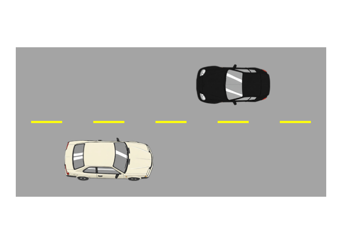

<!-- README.md is generated from README.Rmd. Please edit that file -->

# ggtransport

<!-- badges: start -->

<!-- badges: end -->

The goal of ggtransport is to …

## Installation

You can install the development version of ggtransport from
[GitHub](https://github.com/) with:

``` r
# install.packages("pak")
pak::pak("heike/ggtransport")
```

## Example

This is a basic example which shows you how to solve a common problem:

``` r
library(ggtransport)
## basic example code
```

Draw a sketch of a road segment with two cars:

``` r
draw_multi_lane_road(road_length = 50, lanes_per_direction = 1, lane_width = 12) +
  draw_car(x = -10, y = -6, color = "white", size=1.2) + 
  draw_car(x = 10, y = 6, direction = -180)
```


