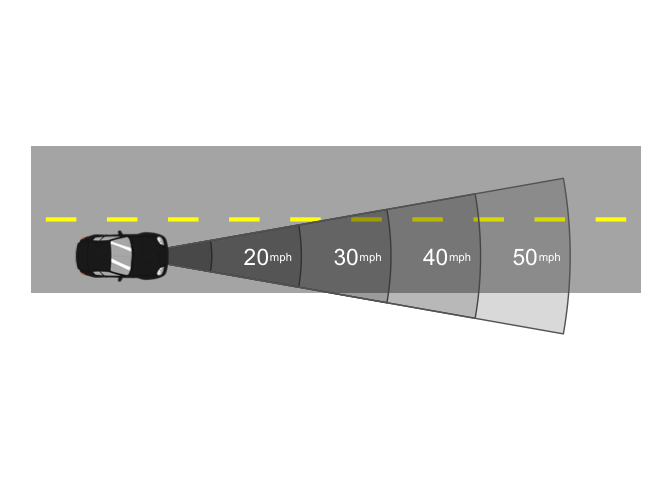

<!-- README.md is generated from README.Rmd. Please edit that file -->

# ggtransport

<!-- badges: start -->

<!-- badges: end -->

The goal of ggtransport is to …

## Installation

You can install the development version of ggtransport from
[GitHub](https://github.com/) with:

``` r
# install.packages("pak")
pak::pak("heike/ggtransport")
```

## Example

This is a basic example which shows you how to solve a common problem:

``` r
library(ggtransport)
## basic example code
```

Draw a sketch of a road segment with two cars:

``` r
draw_multi_lane_road(road_length = 50, lanes_per_direction = 1, lane_width = 12) +
  draw_car(x = -10, y = -6, color = "white", size=1.2) + 
  draw_car(x = 10, y = 6, direction = -180)
```


How far does a car travel at a specified speed?

``` r
library(units)
#> udunits database from /Library/Frameworks/R.framework/Versions/4.4-x86_64/Resources/library/units/share/udunits/udunits2.xml
library(dplyr)
#> 
#> Attaching package: 'dplyr'
#> The following objects are masked from 'package:stats':
#> 
#>     filter, lag
#> The following objects are masked from 'package:base':
#> 
#>     intersect, setdiff, setequal, union
library(ggplot2)
speed_cone <- data.frame(
  speed = set_units(10*1:5, miles/hour),
  time = set_units(rep(1,5), second)
) |> mutate(
  distance = (speed*time) |> set_units(feet) |> as.numeric(),
  start=-10/180*pi + pi/2, # rotate to the right by 90 degrees
  end=10/180*pi + pi/2
)

draw_multi_lane_road(road_length = 100, lanes_per_direction = 1, lane_width = 12) +
  ggforce::geom_arc_bar(
    aes(x0 = -35, y0 = -6, r0 = 0, r = distance, 
        start=start, end=end), data =speed_cone,
        fill="black", alpha = 0.15, colour="grey40") + 
    draw_car(x = -35, y = -6) + 
  geom_text(aes(y = -6, x = -35+ distance-speed_cone$distance[1]/2, label=speed), 
             colour = "white", size = 6,
             data = speed_cone[-1,]) + 
  geom_text(aes(y = -6, x = -35+4+ distance-speed_cone$distance[1]/2, label="mph"), 
             colour = "white", size = 3,
             data = speed_cone[-1,])
```


